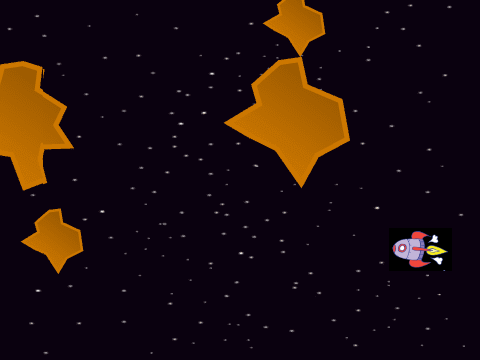
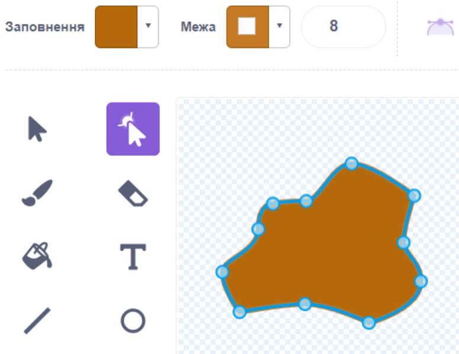

# Вступ {.intro}

Наприкінці 1970-х Atari випустила дві гри, в яких потрібно було керувати космічним кораблем. Першою була "Місячний модуль", але її витіснила "Астероїди", яку Atari випустила кількома місяцями пізніше. Насправді, ігри були настільки схожі, що змогли повторно використати багато технологій. Ми збираємося зробити те ж саме! Отже, перед тим, як розпочати цей проект, вам потрібно буде створити "Місячний модуль". У "Астероїди" ваша мета - захистити свій космічний корабель від астероїдів, розстрілюючи їх на шматки.




# Огляд проєкту {.activity}

*Більшу частину коду для "Астероїди" ви будете писати самостійно (а дещо ви вже написали). У "Астероїди" ми розглянемо деякі способи повторного використання коду у Scratch.*

## План {.check}

- [ ] Ще один літаючий космічний корабель

- [ ] Космічний корабель вміє стріляти!

- [ ] Обережно, астероїди!

- [ ] .. та інші виклики


# Крок 1: Ще один літаючий космічний корабель {.activity}

*У "Місячний модуль" ми зробили чудовий космічний корабель. Тепер ми побачимо, як ми можемо використовувати той самий космічний корабель у цьому проєкті.*

Ви, мабуть, знаєте, що можете реміксувати чужі Scratch-проєкти. Це дає вам можливість створити власну версію того, що зробили інші, і, зокрема, ви можете повторно використовувати код, написаний іншими раніше.

Давайте розглянемо трюк для повторного використання коду, який ми створили в минулому. Використовуючи `Сховок`, ви можете копіювати фігури та код між різними проєктами. Тому спочатку ми скопіюємо космічний корабель, який ми створили у "Місячний модуль".

## Контрольний список {.check}

- [ ] Відкрийте свій проєкт "Місячний модуль".
Зверніть увагу, що в самому низу екрана написано `Сховок`. Натисніть на нього, і перед вами відкриється трохи більше поле.

- [ ] Перетягніть фігуру космічного корабля до відкритого сховку. Копія вашої фігурки космічного корабля залишиться в сховку.

- [ ] Створіть новий проєкт, вибравши команду `Новий` в меню `Файл`. Видаліть символ кота і додайте зоряне тло.

- [ ] Тепер ви можете перетягнути репліку космічного корабля з сховку у вікно персонажа нового проєкту.

  

  Тепер ви побачите, що всі костюми, всі змінні і всі скрипти для космічного корабля були скопійовані. Ви можете трохи навести лад, видаливши скрипти, які не мають нічого спільного з керуванням космічним кораблем, наприклад, якщо у вас є скрипт `Перевірте посадку`, то він нам не потрібен у цій грі.

- [ ] Розмістіть на сцені сценарій, який надсилає повідомлення космічному кораблю про початок польоту після натискання на зелений прапорець. Спробуйте свою гру. Чи зможете ви керувати космічним кораблем?

- [ ] Ми збираємося внести невеликі зміни в поведінку космічного апарату. Астероїди знаходяться далеко в космосі, де немає помітної гравітації. Тому видаліть блок, який моделює гравітацію у вашому циклі `завжди`{.blockcontrol},
`замінити [швидкістьY v] на (-0.01)`{.b}.

- [ ] Ми також робимо дещо більшу зміну в грі. Ми хочемо, щоб космос відчувався трохи великим і захаращеним, тому, коли космічний корабель виходить з екрану з одного боку, він з'являється з іншого боку екрану.

  Ми робимо це за допомогою досить простих тестів `якщо`{.blockcontrol}. Потрібно пам'ятати, що координати `x` на екрані знаходяться в діапазоні від `-240` до `240`, а координати
  `y` від `-180` до `180`. Оскільки Scratch стежить за тим, щоб фігури не виходили повністю за межі екрану, ми зсуваємо їх трохи всередину краю екрану:

  ```blocks
  коли я отримую [Нова гра v]
  завжди
      якщо <(значення x) < [-235]> то
          змінити x на (470)
      slutt
      якщо <(значення x) > [235]> то
          змінити x на (-470)
      slutt
      якщо <(значення y) < [-175]> то
          змінити y на (350)
      slutt
      якщо <(значення y) > [175]> то
          змінити y на (-350)
      slutt
  slutt
  ```


# Крок 2: Космічний апарат може стріляти {.activity}

*Наш космічний корабель незабаром влетить в астероїдний рій, тому нам потрібно встановити ракети, які зможуть підірвати астероїди.*

## Контрольний список {.check}

- [ ] Створіть нового персонажа, якого ви назвете `Постріл`. Ви можете намалювати його самостійно. Ви також можете знайти фігури у вигляді куль, які можна використати як кулі. Використовуйте блок `задати розмір`{.blocklooks}, щоб зробити фігуру потрібного розміру. Також додайте блок `сховати`{.blocklooks}, щоб приховати фігуру.

- [ ] Ми хочемо використовувати клони, щоб зробити більше пострілів. Спочатку нам потрібен код, який створює новий клон пострілу при натисканні клавіші пробілу:

  Створіть скрипт для `Постріл` персонажа, який запускається на повідомленні `Нова гра`. Скрипт може складатися з `завжди`{.blockcontrol} циклу, де перевіряється, чи натиснута клавіша пробілу. Якщо потрібно здійснити постріл, спочатку перемістіть постріл до `перейти до`{.blockmotion} місячного модуля, а потім наведіть його в тому ж напрямку, що й місячний модуль. Останнє можна зробити за допомогою комбінації блоків `повернути в напрямку`{.blockmotion}, `напрям з Місячний модуль`{.blocksensing}. Нарешті, `створити клон з мене`{.blockcontrol}.

- [ ] Щоб переконатися, що при кожному натисканні клавіші пробілу надсилається лише одне повідомлення, ми можемо запустити тест `якщо`{.blockcontrol}, дочекавшись, поки клавішу пробілу знову не буде відпущено. Цей трюк виглядає приблизно так:

  ```blocks
  якщо <клавішу [пропуск v] натиснуто?> то
      чекати поки <не <клавішу [пропуск v] натиснуто?>>
      ...
  slutt
  ```

- [ ] Тепер ми закодуємо поведінку пострілу після того, як він був зроблений. Це може бути досить просто. Коли символ пострілу запускається `коли я стартую як клон`{.blockcontrol}, він повинен з'явитися
  `показати`{.blocklooks}, а потім його можна переміщати у циклі, перш ніж він буде видалений. Експериментуйте зі швидкістю та дальністю пострілу, змінюючи кількість повторень циклу та кількість кроків, які персонаж робить всередині циклу.

- [ ] Нарешті, ми також хочемо, щоб зображення могли зникати з одного боку екрана та з’являтися з іншого. Для цього ми будемо використовувати приблизно такий же код для космічного корабля.

 Щоб копіювати скрипти між фігурами, ви можете використовувати сховок так само, як і раніше. Трохи швидший спосіб - просто перетягнути скрипт, який ви хочете скопіювати, на фігуру, до якої ви хочете скопіювати.

  Скопіюйте код, щоб перемістити з космічного корабля на фігуру `Постріл`.

- [ ] Ми можемо використовувати цей код як є. Єдина зміна, яку нам потрібно внести, це те, що він повинен починатися з `коли я починаю як клон`{.b} замість `коли я отримую [Нова гра v]`{.b} оскільки така поведінка має застосовуватися до всіх клонів.

- [ ] Спробуй свою гру. Тепер ви зможете літати в космосі під час стрілянини.


# Крок 3: Слідкуйте за астероїдами {.activity}

*Тоді настав час створити астероїдний рій. Одна з цікавинок гри Астероїди полягає в тому, що при зіткненні астероїди розлітаються на шматки, і вам все одно потрібно стежити за цими меншими астероїдами і стріляти в них. Ми будемо кодувати це за допомогою клонів різних розмірів.*

## Контрольний список {.check}

- [ ] Створіть фігуру астероїда. Один із способів зробити це - намалювати нову фігуру за допомогою векторної графіки. Почніть з простого квадрата, а потім за допомогою інструмента `Реформувати` додайте більше кутових точок і перемістіть їх, як показано на малюнку нижче.

  

- [ ] Також для астероїдів ми будемо використовувати клони. Створіть скрипт, який приховує
  `сховати`{.blocklooks} персонажа і створює пару клонів астероїдів у випадкових місцях на екрані, коли він отримує повідомлення `Нова гра`.

- [ ] Коли фігура запускається як клон `коли я починаю як клон`{.blockcontrol} , ми хочемо, щоб вона спочатку вказувала у випадковому напрямку:
`повернути в напрямку (випадкове від (0) до (360))`{.blockmotion} а потім з'являлася `показати`{.blocklooks}.
Потім вона може увійти в `завжди`{.blockcontrol} цикл, який повторюється, поки вона не
`торкається`{.blocksensing} місячного модуля. Усередині циклу ви спочатку дозволяєте астероїду пройти кілька кроків `перемістити на .. кроків`{.blockmotion}. Потім потрібно перевірити, чи `торкається`{.blocksensing} астероїд пострілу. Якщо так, ви можете зробити астероїд меншим за допомогою блоку, подібного до

  ```blocks
  задати розмір ((розмір) * (0.9))
  ```

`Якщо`{.blockcontrol} `розмір`{.blocklooks} все ще більший, ніж, наприклад, 10, ви можете створити кілька нових клонів цього меншого астероїда. Нарешті, ви можете `вилучити цей клон`{.blockcontrol} незалежно від його розміру.

- [ ] Додайте повідомлення або блок `зупинити все`{.blockcontrol}, щоб гру можна було завершити після завершення циклу `повторити до`{.blockcontrol}, оскільки космічний корабель зіткнеться з астероїдом.

- [ ] Астероїди також повинні мати можливість вилітати з одного боку екрану і з'являтися з іншого. Тому скопіюйте скрипт, який це виправляє, з постріл фігури.

- [ ] Нарешті, ми також видалимо розстріляні клони, коли вони вдаряться об астероїди. Тут треба бути обережними, щоб не видалити постріляні клони до того, як астероїди зрозуміють, що в них влучили. Це можна зробити, додавши невелику затримку. Наприклад, ви можете ввести такий код у цикл, який переміщує фігурку пострілу:

  ```blocks
  hvis <berører [Asteroide v] ?>
      vent (0.01) sekunder
      slett denne klonen
  slutt
  ```


# Steg 4: Videreutvikling av spillet {.activity}

*Du har nå laget en enkel variant av Asteroids. Men prøv å gjøre spillet
 morsommere ved å videreutvikle det. Du bestemmer selv hvordan du vil jobbe
 videre, men nedenfor er noen ideer som kanskje kan være til inspirasjon?*

## Ideer til videreutvikling {.check}

- [ ] Gi poeng når spilleren treffer en asteroide. Man burde kanskje få flere
  poeng for å treffe de små asteroidene? Det kan du fikse med en utregning
  omtrent som

  ```blocks
  avrund ((100) / (størrelse))
  ```

- [ ] Dersom du plasserer asteroidene helt tilfeldig når et nytt spill starter
  er det ganske sannsynlig at romskipet krasjer i en asteroide allerede før
  spillet har begynt. Det er ikke noe moro. En måte å fikse det på vil være å
  først la asteroideklonen `gå til romskipet`{.blockmotion}, men deretter peke i
  en tilfeldig retning og `gå 100 til 200 steg`{.blockmotion} før det til slutt
  `vises`{.blocklooks}.

- [ ] Spillet ser litt kulere ut om du tegner flere asteroidedrakter, og velger
  en av dem tilfeldig når en klon lages.

- [ ] Dersom man klarer å skyte ned alle asteroidene burde man komme videre til
  et vanskeligere nivå. Kanskje med flere asteroider? Eller med asteroider som
  beveger seg raskere? Eller deler seg i flere deler når de blir skutt?

  For å vite når du kan gå videre til et nytt nivå må du telle hvor mange
  asteroider som flyr rundt. Lag derfor en variabel `Antall
  asteroider`{.blockdata} som du øker med 1 når en asteroide `starter som
  klon`{.blockcontrol}. Deretter må variabelen minke med 1 når klonen slettes.

  Videre bruker du en `Nivå`{.blockdata}-variabel som holder styr på hvilket
  nivå spilleren har kommet til.

- [ ] I det originale Asteroids-spillet dukket det også opp en flyvende
  tallerken (UFO) innimellom. Denne måtte man også passe seg for, men i
  motsetning til asteroidene kunne UFOen skyte tilbake. Prøv å legg til en slik
  UFO i spillet ditt!
