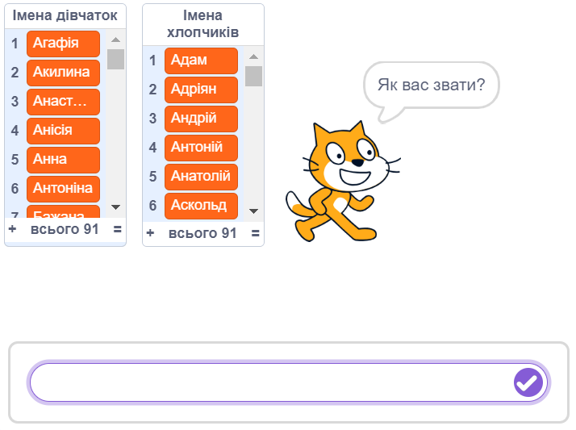
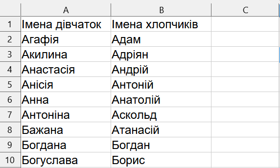
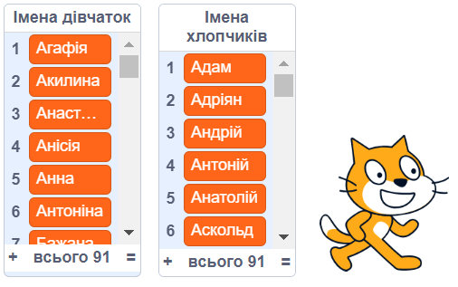

# Вступ {.intro}

Давайте подивимося, як можна використовувати [списки імен](https://docs.google.com/spreadsheets/d/1RlKtvPeGG5bcNv9uiWwC6nC0mB9HJwDltoQRlZR9adM/edit?usp=sharing) у Scratch. Можливо, кіт зможе відрізнити імена дівчаток від імен хлопчиків?




# Крок 1: Списки імен {.activity}

*Погляньмо на списки імен.*

## Контрольний список {.check}

- [ ] Ми хочемо отримати списки з усіма іменами дівчаток та хлопчиків. Їх можна знайти, натиснувши [сюди](https://docs.google.com/spreadsheets/d/1RlKtvPeGG5bcNv9uiWwC6nC0mB9HJwDltoQRlZR9adM/edit?gid=0#gid=0). На цій сторінці ви   побачите **таблицю**, яка містить «**Імена дівчаток** в алфавітному порядку» та «**Імена хлопчиків** в алфавітному порядку». Завантажте цю таблицю у форматі **Excel** або **CSV**.

- [ ] Відкрийте щойно завантажені файли в Excel або подібній програмі для роботи з електронними таблицями.

- [ ] Це буде виглядати приблизно так:

    

- [ ] Це важливо! Збережіть таблицю у форматі CSV. Для цього виберіть **Зберегти як** або **Експортувати** в меню, а потім виберіть формат CSV. Дайте файлу ім'я, яке ви впізнаєте, наприклад, `списки_імен.csv`.

# Крок 2: Перенесіть списки імен до Scratch {.activity}

*Тепер ми можемо читати списки імен у Scratch.*

## Контрольний список {.check}

- [ ] Почніть новий Scratch-проєкт.

- [ ] Створіть новий список, перейшовши на вкладку `Змінні`{.blockdata} і натиснувши кнопку `Створити список`.

- [ ] Дайте ім'я списку **Імена дівчаток**.

- [ ] Клацнути правою кнопкою миші у вікні  `Імена дівчаток` і вибрати пункт `імпорт`. Виберіть CSV-файл, який ви щойно           створили та виберіть 1 стовпчик.

- [ ] Створіть ще один список: `Імена хлопчиків`

- [ ] Клацнути правою кнопкою миші у вікні  `Імена хлопчиків` і вибрати пункт `імпорт`. Виберіть CSV-файл  та виберіть 2          стовпчик.

    

- [ ] Списки імен є прикладами того, що у Scratch просто називається списками. Вони програмуються за допомогою цеглинок,       розташованих у категорії `Змінні`{.blockdata} Як і у випадку зі змінними, ви можете видалити списки зі Сцени, знявши з них позначку, клацнувши правою кнопкою миші або скориставшись блоком `сховати список [Імена дівчаток v]`{.b}.

# Крок 3: Використовуйте списки імен {.activity}

*Зараз ми напишемо невелику програму, яка використовує списки імен. Можливо, ми зможемо навчити нашого кота розпізнавати різницю між іменами дівчаток та хлопчиків?*

## Контрольний список {.check}

- [ ] Ми починаємо з того, що дозволяємо коту попросити ім'я. Для цього ми можемо використати блок `запитати
  [ Як вас звати?] і чекати`{.b}.

- [ ] For at katten skal kunne huske navnet vi forteller den vil vi bruke en
  variabel. Klikk på `Data`{.blockdata} og deretter `Lag en variabel`. Kall
  variabelen `(Navn)`{.b}.

- [ ] Vi kan nå ta vare på svaret i `(Navn)`{.b}-variabelen.

  ```blocks
  spør [skriv et navn] og vent
  sett [Navn v] til (svar)
  ```

- [ ] Om du ser på klossene som nå finnes i `Data`{.blockdata}-kategorien er det en
  som sier `<[Guttenavn v] inneholder [thing]?>`{.b}. Denne klossen kan vi bruke
  for å finne ut om et navn finnes i jentenavnlisten eller guttenavnlisten
  (eller begge eller ingen av dem).

- [ ] Lag en sjekk for om `(Navn)`{.b} er et jentenavn:

  ```blocks
  spør [skriv et navn] og vent
  sett [Navn v] til (svar)
  hvis <[Jentenavn v] inneholder (Navn)?>
      si (sett sammen (Navn) [ er et jentenavn]) i (2) sekunder
  slutt
  ```

## Test prosjektet {.flag}

__Klikk på koden din.__

- [ ] Spør katten deg om å skrive inn et navn?

- [ ] Skriv inn et jentenavn, for eksempel `Emma`. Sier katten at `Emma er et
  jentenavn`?

- [ ] Hva skjer om du skriver inn et guttenavn? Eller et ord som ikke er et navn?

## Sjekkliste {.check}

- [ ] Lag en sjekk for om `(Navn)`{.b} er et guttenavn. Prøv å lag denne selv. Du
  kan gjøre det på akkurat samme måte som for jentenavn. Legg den nye
  hvis-testen under den du allerede har.

- [ ] Legg til en `gjenta for alltid`{.b}-løkke rundt hele koden din. På den måten vil
  katten stadig spørre deg om nye navn.

- [ ] Legg også en `når grønt flagg klikkes`{.b}-kloss på toppen av koden din, slik
  at du kan starte programmet ved å klikke på det grønne flagget.

## Prøv selv {.challenge}

- [ ] Dette er et veldig enkelt eksempel på hva man kan gjøre med navnelistene (og
  det har noen problemer: for eksempel finner ikke katten dobbeltnavn
  som `Geir Arne`). Har du noen ideer til hvordan du kan bruke navnelistene på
  en enda mer spennende måte?

- [ ] Kjenner du til andre datasett som du har lyst til å jobbe med i Scratch? Bruk
  [dataverktøyet](../data/data.html) for å lese inn dataene.
